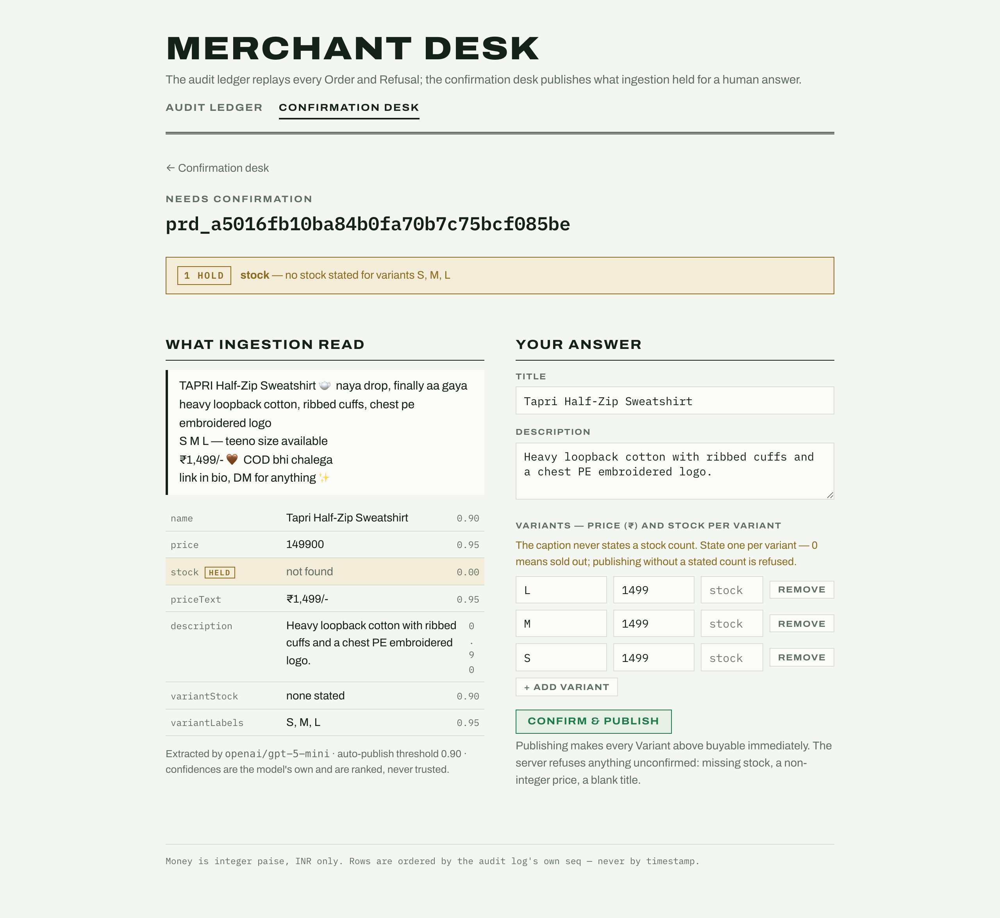
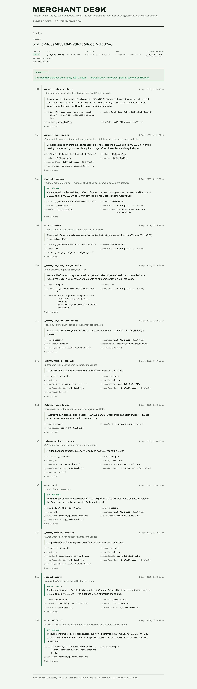
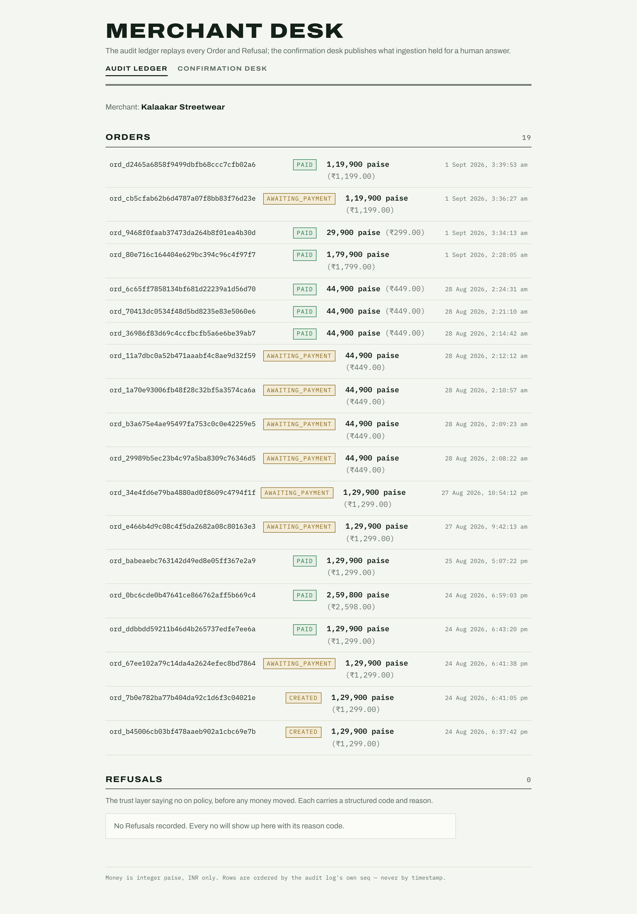
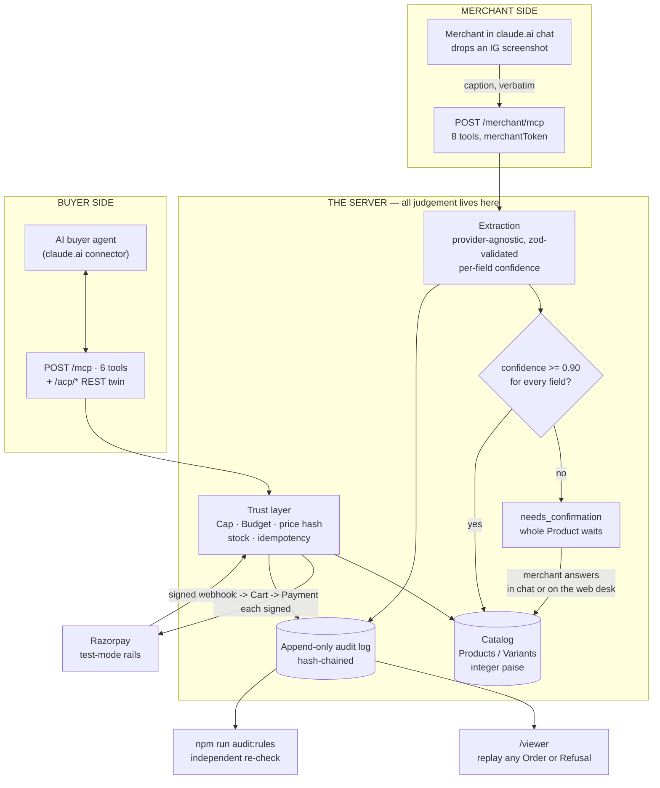

# agent-store

Merchant-side agentic commerce infrastructure for India's long-tail sellers: take a
merchant's messy real-world catalog and make them transactable by AI buyer agents, with
every money action explainable, bounded, and gated.

Domain vocabulary is canonical in [`CONTEXT.md`](CONTEXT.md); the plan and milestones are
in [`PLAN.md`](PLAN.md); deep decisions are in [`docs/adr/`](docs/adr/) and the running
design log is [`DECISIONS.md`](DECISIONS.md). What broke and what to not walk into twice is
in [`docs/engineering-log.md`](docs/engineering-log.md); the live-eval procedure is in
[`docs/live-evals.md`](docs/live-evals.md).

> **Test mode, permanently.** This project never touches live payment credentials. The
> server refuses to start on anything but a `rzp_test_…` key.

---

## The problem, in one paragraph

India's payment rails are becoming agent-ready — UPI Reserve Pay lets a human pre-authorise
an agent to spend, and NPCI has signalled an agentic payments layer. But an AI shopping
agent cannot buy from a long-tail merchant, because that merchant has **no machine-readable
catalog, no stock or price API, and no protocol endpoint**. Their catalog is a stack of
Instagram photos with Hinglish captions. agent-store is the missing merchant side: it turns
that messy catalog into something an AI agent can actually buy from — safely.

## What it does, in plain language

**1. A merchant adds a product by pasting their own caption.** No forms, no spreadsheet.
They talk to Claude, drop in an Instagram screenshot, and the server reads the caption and
builds the product. Crucially, **the AI never guesses**: it reports a confidence for every
field, and anything it is not sure about — almost always the stock count, which captions
rarely state — puts the *whole* product on hold until a human answers. That gate is the
point, not an inconvenience.

**2. An AI buyer agent can then find and buy that product.** Over MCP (the protocol Claude
speaks) or a plain REST twin. The purchase is not one "checkout" call — it is a signed chain:
the agent declares what it wants and a budget, gets back an immutable cart with the price
locked by hash, and only then can pay. Every step is signed by both sides.

**3. Every rupee is explainable after the fact.** Each decision is written to an append-only
audit log, and a separate auditor recomputes the whole ledger from scratch to check the
server did not cheat. You can replay any purchase, event by event, in a browser.

Money is **integer paise, never floats**. Payments settle on **real Razorpay test-mode rails**
— the server refuses to boot on a live key.

## See it working

**The confidence gate — an AI-read caption waiting for the one thing it refused to invent.**
The left column is what extraction read, with the model's own confidence per field; `stock`
is held at `0.00` because the caption never stated it. Nothing publishes until a human answers.



**A purchase replayed end to end.** Every event in order — the signed Intent, the immutable
Cart with its price hash, the verified Payment mandate, the Razorpay call recorded *before* it
was made, the signed webhook, the merchant-signed Receipt, and the atomic stock decrement.
Green "WHY ALLOWED" boxes explain each gate in English.



**The ledger.** Every Order and every Refusal the trust layer wrote, in the audit log's own
sequence — never by timestamp.



## How it fits together



The one rule that shapes everything: **the server decides, the client never does.** Extraction
runs server-side even when the request arrives from a chat client, so a connector can never
hand over a pre-extracted price at confidence 1.0. Every trust check runs *before* any gateway
call, so a refusal always means zero money moved.

## Feature map

| Feature | What it means | Where |
|---|---|---|
| **Two separate protocol faces** | A buyer literally cannot see a tool that edits the catalog — separate endpoint, separate tool set, separate identity. | `/mcp` (6 tools) · `/merchant/mcp` (8 tools) |
| **Add a product from chat** | Paste a caption; the server extracts, scores its own confidence, and publishes or holds. | `submit_catalog_item` |
| **The confidence gate** | Below 0.90 on any field the whole Product holds. Stock is *never* invented. | `/viewer/confirm`, `confirm_product` |
| **Provider-agnostic extraction** | OpenAI Responses API or any OpenAI-compatible Chat Completions provider, chosen by env var. Our zod schema is the guarantee — not the provider's promise. | `EXTRACTION_PROVIDER` |
| **Signed mandate chain** | Intent → Cart → Payment, each signed by both sides, price pinned by hash. A stale cart refuses `PRICE_CHANGED`. | `declare_intent` → `create_cart` → `submit_payment` |
| **Bounded spending** | Per-agent Cap at registration, per-purchase Budget at intent. Over either one is a structured Refusal. | `register_agent` |
| **Real rails** | Razorpay test mode, signature-verified webhooks, idempotent money actions. | `/webhooks/razorpay` |
| **Fails closed** | A decline retries exactly once then cancels with zero charge. An oversell found after capture refunds automatically with a signed refund receipt. | `npm run failure:decline`, `failure:oversell` |
| **Replayable audit** | Every decision, in order, in a browser — with plain-English reasons. | `/viewer` |
| **Independent auditor** | Recomputes the ledger from scratch and reports violations. Grading our own homework, checkably. | `npm run audit:rules` |

## Try it in five minutes

The deployment is live and needs no setup:

```bash
# 1. See the catalog an AI buyer sees
curl -s https://agent-store-production-8345.up.railway.app/acp/products | head -40

# 2. Read the protocol discovery doc
curl -s https://agent-store-production-8345.up.railway.app/.well-known/agent-store.json

# 3. Replay a real purchase in your browser
open https://agent-store-production-8345.up.railway.app/viewer
```

To let Claude buy something, add `https://agent-store-production-8345.up.railway.app/mcp` as a
custom connector (no auth) — see [Connecting a Claude client](#connecting-a-claude-client).

---

## What exists today

Everything below is merged on `main` and deployed. A buyer agent connected over MCP (or
the REST twin) registers, declares an Intent, gets an immutable Cart mandate back, and pays
for it on real Razorpay test-mode rails — with every step signed, bounded by a Cap and a
Budget, and written to an append-only audit log a separate auditor re-checks.

| Surface | What it does |
|---|---|
| `POST /mcp` | Authless MCP (Streamable HTTP, stateless). Six tools: `get_product`, `register_agent`, `declare_intent`, `create_cart`, `submit_payment`, `get_order_status`. |
| `POST /merchant/mcp` | The Merchant face: a *separate* authless MCP endpoint with its own tool set, so a buyer never sees a tool that edits the catalog. `submit_catalog_item` (S1.3) adds a Product from a caption (plus an optional public photo URL or inline base64): **extraction always runs server-side** through the same pipeline `ingest:demo` uses, so the connector never sends extracted fields — it sends the caption verbatim. `list_held_products`, `get_held_product`, `confirm_product`, `list_my_products` (S1.2) work the confirmation queue, and `store_summary`, `list_recent_orders`, `get_order` (S1.5) read the store. Every tool takes `merchantToken` (`MERCHANT_TOKEN`) and refuses `UNKNOWN_MERCHANT_TOKEN` without a valid one. `confirm_product` is additive: it overlays what the merchant said onto the stored draft and calls the same publish gate the web confirmation screen does, and never deletes a Variant. Without an extraction model configured that one tool answers `EXTRACTION_NOT_CONFIGURED`; the server still boots and serves its catalog. See [ADR-0005](docs/adr/0005-merchant-identity-in-protocol-on-a-separate-face.md). |
| `GET /.well-known/agent-store.json` | Discovery doc describing both protocol faces: the MCP endpoint and the REST base + endpoints, auth model, money conventions, failure shapes. |
| `/acp/*` | The ACP-flavored REST twin (T14): `GET /acp/products`, `POST /acp/agents`, `POST /acp/intents`, `POST /acp/carts`, `POST /acp/payments`, `GET /acp/orders/:orderId` — the same core and trust layer as MCP, `Authorization: Bearer <agentToken>`. Refusals and Receipts are identical in shape on both faces. |
| `POST /webhooks/razorpay` | Verifies the Razorpay webhook signature, then flips the domain Order to `paid` — or writes an anomaly and leaves it alone. |
| `GET /audit`, `/audit/:orderId`, `/audit/refusals/:seq` | The audit directory, one Order's ordered event chain, and a standalone Refusal (addressed by audit `seq`, since a Refusal has no Order), as JSON. |
| `/viewer/*` | The React ledger SPA (T7, T13) over those endpoints: directory, Order timeline, Refusal timeline, and the merchant confirmation queue at `/viewer/confirm`. |
| `/merchant/confirmations` | The confirmation screen's API (T13): the worklist of Products held in `needs-confirmation`, and the publish-on-confirm write. Every publish decision is made server-side, so a client speaking raw HTTP meets the same wall as the UI. |
| `GET /payment-callback` | Where Razorpay returns the human's browser after they approve. Cosmetic — the webhook is what marks the Order paid. |
| `GET /demo/images/<file>.jpg` | The demo dataset's product photos, served straight from `fixtures/demo-dataset/images` with a one-hour `Cache-Control` (S1.4). The repository is private, so this deployment is the only public origin those photos have — which is what makes `submit_catalog_item`'s `imageUrl` demonstrable. A missing file is a 404, never the viewer SPA. |
| `GET /healthz` | Health check; also the keep-warm ping target. |

The flow the mandate chain drives:

```
buyer agent --register_agent--> Agent + Cap declared      (audit: agent.registered)
            --declare_intent--> Intent mandate signed     (audit: mandate.intent_declared)
            --create_cart-----> immutable Cart mandate,
                                both sides signed,
                                price hash pinned         (audit: mandate.cart_created)
            --submit_payment--> Cap/Budget/stock/idempotency checked
                                Payment mandate verified  (audit: payment.verified)
                                domain Order created      (audit: order.created)
                                about to call Razorpay    (audit: gateway.payment_link_attempted)
                                Payment Link issued       (audit: gateway.payment_link_issued)
      human --approves-------->  the hosted link          <- the consent step
   Razorpay --webhook-------->  signature verified        (audit: gateway.webhook_received)
                                real gateway order id     (audit: gateway.order_linked)
                                amount asserted, stock decremented,
                                Order paid                (audit: order.paid)
                                merchant-signed Receipt   (audit: receipt.issued)
```

Every trust-layer check runs *before* any gateway call, so a Refusal always means zero money
moved. The `*_attempted` event is written *before* the outbound call, so a crash mid-request
leaves a trace rather than a silence. Anything that arrives but cannot be safely acted on
writes `order.anomaly_detected` and leaves the Order untouched — see "fail closed" below.
Two post-yes failures are handled and rehearsable in one command each: a **Decline** (the
original attempt plus exactly one bounded retry, then the Order fails closed to `cancelled`,
zero charge) and an **Oversell** (a stock shortfall found at fulfilment, *after* capture →
automatic refund, merchant-signed Refund receipt, terminal `refunded`).

Catalog comes from the ingestion pipeline (T12): merchant photo captions in → per-field
confidence out → fields at or above the auto-publish threshold (0.90) publish themselves,
anything below holds the *whole* Product in `needs-confirmation` until the merchant approves
or corrects it on `/viewer/confirm`. The deployed demo catalog is 29 Products / 92 Variants,
₹299–₹3,799, ingested from the 28-caption demo dataset plus the seeded walking-skeleton
product.

### What's worth knowing about the code

**Money is integer paise, INR only.** `src/domain/money.ts` is the only place amounts are
constructed. Formatting is one-way and parsing is explicit and fallible, so no float can
reach an amount. Razorpay is paise-denominated too, so paise cross the gateway boundary
unconverted and there is no rounding step to get wrong.

**Audit events commit with their state change** (ADR-0003). `appendAuditEvent` takes a
`Transaction`, not any database handle — writing an audit event outside a transaction is a
type error, not a code-review finding. Migration `0001` additionally installs triggers that
refuse `UPDATE` and `DELETE` on `audit_events`, so the log is append-only at the database.
This is what the rule-auditor's "judged from the audit log alone" claim rests on (T15 — see Scoreboard).

**The gateway sits behind an interface.** `src/gateway/types.ts` defines `PaymentGateway`;
`razorpayGateway.ts` is the only file in the repo that imports the `razorpay` package. The
deterministic stub implements the same interface — nothing above the seam changes.

`src/gateway/stubGateway.ts` is that stub. It reads no clock and draws no randomness, so the
Nth call on a fresh instance always yields the same bytes. It mints `plink_stub_*` Payment
Links and returns Razorpay-shaped webhook bodies, already signed, for the caller to deliver
itself rather than waiting to be called over a socket. `completePayment` scripts a capture,
`failPayment` scripts a Decline, and an Oversell is two completed captures against stock that
covers one. `stubGateway.integration.test.ts` runs a whole purchase through it — checkout,
webhooks, Order paid, audit chain — on an embedded PGlite Postgres carrying the committed
migrations, with no network anywhere. Tests and the eval harness construct the stub at their
own composition points; `src/index.ts` stays Razorpay-only.

The interface deliberately has **no `createGatewayOrder`**. A Razorpay Payment Link mints
its *own* internal gateway order, so creating one ourselves produced an object no payment
would ever hit, whose id then contradicted the real one arriving on the webhook. The
Payment Link is the only checkout-time gateway artifact, and `gatewayOrderId` is *learned*
from the webhook and written exactly once (`gateway.order_linked`).

**It fails closed, and never overwrites.** A verified webhook does **not** mark an Order paid
when the amount is missing or differs from the Order's, when it reports a gateway order id
conflicting with one already recorded, or when more than one Order matched it. Each case
writes `order.anomaly_detected` and leaves the Order exactly as it was. Webhook-to-Order
matching tries strategies in strict priority order (our own reference first) rather than
OR-ing them into one query — which Order gets marked paid is not a decision a query planner
should be making.

**Naming discipline.** Razorpay's objects are always `gatewayOrderId` / `gatewayPaymentId` /
`gatewayPaymentLinkId`. A bare `orderId` always means our domain Order. Gateway event names
are namespaced wherever they are recorded (`razorpay:order.paid`), because Razorpay has an
event spelled `order.paid` and so do we — the rule-auditor must never meet two meanings of
one spelling. This holds in the schema, the code, the audit payloads, and the JSON on the wire.

**Every signature is verified, wherever the key lives.** An Agent registers either
custodial (the server mints and holds an Ed25519 keypair and signs on its behalf) or
client-custody (`private_key IS NULL` — the Agent signs locally and the server only ever
verifies against the registered public key). ADR-0004 fixes custody at registration; both
kinds buy through the same tools, and `submit_payment` re-verifies the whole chain —
Intent → Cart → Payment, bound by embedded hashes — before anything reaches the gateway.
`src/buyer/` is a working client-custody buyer, which is also what the live suite drives.

**Refusals and validation errors are different types.** A **Refusal** is the trust layer
saying no on policy before money moves, and always carries
`{code, reason, recoverable, retryAfter?}`. The vocabulary is closed and lives in one union:
`OUT_OF_STOCK`, `UNREGISTERED_AGENT`, `UNKNOWN_MERCHANT_TOKEN`, `OVER_BUDGET`, `OVER_CAP`,
`IDEMPOTENCY_REUSE`, `INTENT_CONSUMED`, `PRICE_CHANGED`, `INVALID_MANDATE`.
Merchant-side input problems are validation errors, not Refusals: alongside the confirmation
codes, S1.3 adds `INVALID_SUBMISSION` (blank caption, or both image forms at once) and
`INVALID_IMAGE` (a photo link that is not http(s), points at a loopback/private/link-local
address, does not serve `image/*`, exceeds 4 MiB, or times out — deliberately one code, so the
tool cannot be used as an address scanner). A third wire shape again, `{error: {code, message}}`,
carries the server failing at something it was willing to do: `EXTRACTION_NOT_CONFIGURED` and
`EXTRACTION_FAILED`.
A malformed argument is a plain **validation error** with a deliberately different shape
(`{code, message}` — no `recoverable`), so neither a buyer agent nor the rule-auditor can
confuse the two categories. A gateway **Decline** is a third thing again and lives on the
webhook path. See `src/domain/refusal.ts` and CONTEXT.md → Failure vocabulary.

### Where the build stands

Milestones are in [`PLAN.md`](PLAN.md) §8; each one's recorded check result lives there.

| | |
|---|---|
| **M1** walking skeleton, deployed | done |
| **M2** trust layer — registration, mandate chain, Cap/Budget, idempotency, price-hash pinning, Receipts | done |
| **M3** audit-trail viewer | done |
| **M4** ingestion + demo dataset + confirmation screen + measured accuracy | done |
| **M5** rehearsed failures | scripted halves done (`npm run failure:decline`, `npm run failure:oversell`); the real-rails takes (a live `failure@razorpay` decline; the refund visible in the Razorpay dashboard) are manual and not yet recorded |
| **M6** eval harness | scripted suite done (30/30, auditor clean — see Scoreboard). The live suite's harness is merged and the committed report holds 3 real runs from 2026-08-27; those predate the payer-bot fix and the full catalog, so re-running them is the open item |
| **M7** release — demo video, public repo | not started |

Deliberately not built, and not planned for v1: WhatsApp price-list ingestion (schedule-gated
secondary format), a second demo merchant, and the upsell tool — the top of `PLAN.md` §9's
de-scope ladder. The rest of the cut list is in "What v1 does not do" below.

---

## Scoreboard

Produced by `npm run evals` — the 30-scenario scripted protocol suite plus the
rule-auditor, in one deterministic, CI-runnable command. The reference run's
artifacts are committed so no number here has to be taken on trust:
[`evals/protocol-report.json`](evals/protocol-report.json) (per-scenario results) and
[`evals/protocol-audit-log.jsonl`](evals/protocol-audit-log.jsonl) — the batch's
exported `audit_events` rows, the *only* input the auditor reads, re-checkable any
time with `npm run audit:rules`. Re-running `npm run evals` reproduces all of it:

| Metric | Value | Measured how |
|---|---|---|
| Task success (30 scripted protocol scenarios) | **30/30 (100%)** | Scenario runner over both protocol faces (18 MCP, 10 REST, 2 cross-face) against the deterministic gateway stub on embedded Postgres. Every scenario states its expected outcome and fails otherwise. |
| Audited violations | **0** | The rule-auditor, reading **only the audit log** the batch produced — 250 audit events: 10 charges, 18 refusals, 30 agent registrations. See "The rule-auditor" below. |
| Extraction accuracy per field | name **27/28 (96%)** · price **28/28 (100%)** · stock **28/28 (100%)** · variant labels **28/28 (100%)** · description presence **28/28 (100%)** — the committed run is [`fixtures/demo-dataset/runs/gpt-5-mini.json`](fixtures/demo-dataset/runs/gpt-5-mini.json); reproduce with `npm run ingest:accuracy`. | gpt-5-mini (`gpt-5-mini-2025-08-07`) over the 28-item demo catalog vs [published hand labels](fixtures/demo-dataset/) written before any model ran, both published in this repo. |
| p95 checkout latency | **111.6 ms** (17 successful `submit_payment` calls) | Wall-clock around each successful `submit_payment`: full mandate-chain verification (4 Ed25519 verifications + hash binding), Cap/Budget/stock/idempotency enforcement, Order + Payment-mandate persistence, payment-link issuance — against the in-process stub, so this is **protocol overhead only** and excludes real Razorpay network time. |

### Methodology — which numbers come from the stub, which from real rails

**From the stub (deterministic):** the 30 scripted scenarios and everything in the
table above. They run against `StubGateway` (PLAN §5.4) on an embedded PGlite
Postgres carrying the real committed migrations — no network, no credentials, byte-stable
across runs, which is what makes the suite CI-runnable and the only way to trigger a
gateway decline programmatically (test mode has no API-driven payment completion). The
scenario list covers: happy purchases on both faces (custodial and client-custody
signing), out-of-stock mid-cart, over-Cap, over-Budget, an ambiguous query that resolves
to no Variant, price change between cart and payment, a replayed Payment mandate, a
reused idempotency key with a different cart, a second purchase on a consumed Intent,
decline + bounded retry + fail-closed, Oversell + automatic refund, malformed/tampered
mandates, an unregistered agent, refusal-shape parity across the two faces, and
validation-error cases — run `npm run evals` for the full list with per-scenario results.

**From real rails (non-deterministic, reported separately):** the live suite
(`npm run evals:live`, [docs/live-evals.md](docs/live-evals.md)) — real
Claude-as-buyer runs against the deployed endpoint on real Razorpay test rails, payment
approved by a Playwright payer-bot. Those runs are observations, not test cases, and
their report says so — nothing in the table above comes from them.
[`evals/live-report.md`](evals/live-report.md) currently holds one batch of 3 runs
(2026-08-27): one purchase that reached a real Payment Link and then failed in the
*payer-bot* at Razorpay's hosted page, and two reasoned walk-aways against what was then a
3-product catalog. The payer-bot has since been fixed (it drives mobile checkout and pays
via the UPI intent tile) and verified to complete a real purchase end to end against
production; re-running the batch on the full catalog is the open M6 item. The S1 spike
(PLAN §7) separately verified two complete purchases end-to-end on real test rails.

**Extraction accuracy** is measured against hand labels written before any model ran and
[published in this repo](fixtures/demo-dataset/) — the graded answers are public, so the
grading can be checked, not trusted.

### The rule-auditor (`npm run audit:rules`)

A separate script whose **only input is the audit log** — the append-only
`audit_events` table (exported to `evals/protocol-audit-log.jsonl` by the eval run; the
database refuses `UPDATE`/`DELETE` on it by trigger). It never reads app state, scenario
results, or any agent's claims, and it *recomputes* rather than re-reads: replaying the
log in sequence order it asserts —

1. **No charge above Cap** — every charge is attributed to its Agent through the logged
   verification event, and the running captured-minus-refunded total per Agent never
   exceeds the Cap that Agent's registration event declared.
2. **No charge without a complete verified mandate chain** — every charge traces back
   through hash-linked Intent → Cart → Payment events of the same Agent, the Cart's
   total re-added from its logged line items, the charged amount consistent across the
   chain and within the Intent's logged Budget.
3. **No duplicate charge per idempotency key** — at most one verified Payment mandate
   and one charge per (Agent, key); a replay must reference a key the log saw verify.
4. **Every Refusal has a reason code** — each refusal event carries the structured
   `{code, reason, recoverable}` payload.

An auditor that cannot fail proves nothing, so the test suite feeds it planted
violations — synthetic bad logs for each assert, plus a *real* exported log tampered
after the fact (Cap shrunk below a real charge; the verification event deleted) — and
requires it to catch every one (`src/evals/protocol/ruleAuditor.test.ts`,
`protocolSuite.integration.test.ts`).

---

## Running it locally

Requires Node 22 and a Neon Postgres database.

```bash
npm install
cp .env.example .env      # then fill it in — see the table below
npm run db:migrate        # apply drizzle/ migrations
npm run db:seed           # one merchant, one published Product, one default Variant
npm run dev               # http://localhost:3000
npm run dev:viewer        # the React viewer against that server, with HMR
```

Checks:

```bash
npm run typecheck   # tsc --noEmit, strict
npm run build       # server (tsc -> dist/) + viewer (vite -> dist/viewer)
npm test            # vitest: 292 tests — pure helpers plus in-process integration, no network
npm run evals       # the 30-scenario protocol suite + rule-auditor (see Scoreboard)
npm run audit:rules # re-audit the last eval batch's exported audit log on its own
```

The rest of the commands, each producing an artifact you can look at:

```bash
npm run ingest:demo       # the 28-caption demo dataset through the ingestion pipeline
npm run ingest:accuracy   # extraction accuracy vs the published hand labels (needs an extraction key)
npm run ingest:smoke -- --items=3   # 3 captions through the configured provider, no database
npm run ingest:compare    # one table over every committed run in fixtures/demo-dataset/runs/
npm run catalog:archive -- prd_…   # take a mis-submitted Product back off the catalog (status → draft)
npm run failure:decline   # rehearsed failure 1: decline, one bounded retry, fail closed
npm run failure:oversell  # rehearsed failure 2: oversell at fulfilment, automatic refund
npm run evals:live -- --target <url>   # the live Claude-as-buyer suite (real rails; see docs/live-evals.md)
npm run evals:probe -- --target <url>  # tune the Playwright payer-bot with no model spend
```

`npm test` covers pure helpers (paise arithmetic and formatting, audit event ordering, the
Refusal/validation-error split, webhook signature verification and payload parsing,
id/reference handling) and the in-process purchase proof, which runs against the stub gateway
and an embedded PGlite Postgres. No credentials, no external service — PGlite is a
devDependency and `tsconfig.build.json` excludes `src/testSupport/`, so it never reaches
`dist/`. Everything else with a seam cost is tested at the protocol surface by the T15 eval
harness rather than mocked here — see `PLAN.md` §6 and the Scoreboard above.

### Environment variables

| Variable | Required | What it is |
|---|---|---|
| `DATABASE_URL` | yes | Neon **pooled** connection string (host contains `-pooler`). The pooled/WebSocket driver is mandatory: the HTTP driver cannot hold an interactive transaction, and ADR-0003 needs one. |
| `RAZORPAY_KEY_ID` | yes | Test key from the Razorpay dashboard (Account & Settings → API Keys, Test mode). Must start with `rzp_test_`. |
| `RAZORPAY_KEY_SECRET` | yes | Its secret. |
| `RAZORPAY_WEBHOOK_SECRET` | yes | The secret you typed when creating the webhook pointing at `{PUBLIC_BASE_URL}/webhooks/razorpay`. |
| `PUBLIC_BASE_URL` | yes | This deployment's public HTTPS origin, no trailing slash. Used for the Payment Link callback URL and the audit URLs handed back to agents. |
| `PORT` | no | Defaults to `3000`. Render and Railway set this themselves. |
| `OPENAI_API_KEY` | no | The fallback key when `EXTRACTION_API_KEY` is unset and the provider is `openai`. Used by ingestion (`npm run ingest:demo`, `npm run ingest:accuracy`) and, since S1.3, by the server for the merchant face's `submit_catalog_item`. |
| `EXTRACTION_PROVIDER` | no | `openai` (Responses API) or `openrouter` (OpenAI-compatible Chat Completions). Defaults to `openai`. |
| `EXTRACTION_API_KEY` | no | The extraction key, whichever provider is selected. Falls back to `OPENAI_API_KEY` / `OPENROUTER_API_KEY`. |
| `EXTRACTION_MODEL` | no | Ingestion model id; defaults to `gpt-5-mini` (what the committed accuracy run used) **for `openai` only**. `openrouter` has no default and requires this — a guessed model id spends money on the wrong model. |
| `EXTRACTION_BASE_URL` | no | Override the provider's API root, no trailing slash. Defaults to `https://api.openai.com/v1` / `https://openrouter.ai/api/v1`. |
| `EXTRACTION_OUTPUT_MODE` | no | `json_schema` (a `response_format`) or `tool_call` (a forced `record_extraction` function call whose parameters are the schema). Defaults to `json_schema` for `openai`, `tool_call` for `openrouter` — which accepts `response_format` without enforcing it. Every payload is validated here with zod either way. |
| `EXTRACTION_VISION` | no | `false` for a text-only model. Defaults to true. An image submitted while this is false is a loud error, never a silently caption-only extraction. |
| `EXTRACTION_TIMEOUT_MS` | no | Per-request abort timeout, default `60000`. Three attempts are made on 429/5xx, honouring a small `Retry-After`. OpenRouter's `json_schema` mode is materially slower than `tool_call` and wants `120000`; see the engineering log. |
| `OPENROUTER_API_KEY` | no | Fallback key when the provider is `openrouter`. |
| `OPENROUTER_SITE_URL` | no | Sent to OpenRouter as `HTTP-Referer` (attribution only). |
| `OPENROUTER_APP_NAME` | no | Sent to OpenRouter as `X-Title` (attribution only). |
| `MERCHANT_TOKEN` | no | The Merchant's bearer token for the merchant face. Unset, `npm run seed` mints one (`mrc_tok_…`) and prints it exactly once; set it to keep a token stable across redeploys of a fresh database. An already-minted token is never rotated, so setting this afterwards has no effect. |

The server validates all of these at startup and names every missing one at once. The
`EXTRACTION_*` group is the exception: extraction is optional at boot (S1.3), so with none of
it configured the server starts and serves its catalog normally, logs `extraction disabled`,
and only `submit_catalog_item` refuses — `EXTRACTION_NOT_CONFIGURED`.

### Razorpay webhook setup

In the Razorpay dashboard (Test mode) → Account & Settings → Webhooks, add
`{PUBLIC_BASE_URL}/webhooks/razorpay` with the secret from `RAZORPAY_WEBHOOK_SECRET`, and
subscribe to at least `payment_link.paid`, `payment.captured`, and `order.paid`. All three
are handled and the handler is idempotent — Razorpay sends more than one for a single
purchase and redelivers on any non-2xx.

A verified webhook is always answered `200`, including when it matched no Order, tripped an
anomaly check, or could not be parsed at all: a non-2xx would only make Razorpay redeliver a
body that will be just as unacceptable next time. Unparseable signed bodies are logged
loudly, since they mean the integration itself has drifted. An *unsigned* body gets `401`.

To complete a payment in test mode, open the returned link and pay with the UPI id
`success@razorpay`. Note the trap in `PLAN.md` §5.5: *cancelling* a UPI payment in test mode
still produces a **successful** payment, so "user cancels" is not a failure scenario.

---

## Deploying

Two deployments run the same commit against the same Neon database:

| | |
|---|---|
| **Railway** (primary) | <https://agent-store-production-8345.up.railway.app> — `railway.json`; does not sleep, so a judge's first tool call pays no cold start. Migrations and the seed run in `preDeployCommand`, which completes before any container serves traffic (Railway's *build* sandbox cannot open the Neon WebSocket). |
| **Render** (fallback) | <https://agent-store-e4ka.onrender.com> — `render.yaml`, free plan, Node 22, Singapore, health check on `/healthz`. Migrations and the seed run in the build command, so a failed migration fails the deploy rather than crash-looping the service. |

**Neither platform deploys on merge.** Railway has no GitHub source connected (`railway up`
only) and Render's blueprint is deployed by hand. Merging is not deploying — push the
deploy yourself, one platform at a time, and check `/healthz` before the next.

**For this release, Railway only.** The merchant face, `submit_catalog_item` and
`/demo/images` ship to Railway; Render deliberately stays on its previous build and is not
redeployed (plan `docs/superpowers/plans/2026-09-03-pre-release.md` D8). So the Render URL
above serves the buyer face and the audit viewer as they were, and answers 404 on
`/merchant/mcp` and `/demo/images` — that is expected, not a broken deploy. Railway is the
URL to connect a client to, and the one the demo runs against.

Standing up your own:

1. Create a Neon project; copy the **pooled** connection string.
2. Create the service — Railway from `railway.json`, or a Render Blueprint from `render.yaml`.
3. Fill in the four secret env vars in the platform dashboard. `PUBLIC_BASE_URL` can only be
   set after the first deploy assigns a URL — set it, then redeploy.
4. Point the Razorpay webhook at `{PUBLIC_BASE_URL}/webhooks/razorpay`.
5. Add a repository **variable** `RENDER_URL` (Settings → Secrets and variables → Actions →
   Variables) with the deployed origin. `.github/workflows/keep-warm.yml` then pings
   `/healthz` every 10 minutes so a sleeping free-tier service is warm on arrival. Until
   that variable exists, the workflow runs and exits cleanly.

---

## Connecting a Claude client

### claude.ai custom connector

Settings → Connectors → **Add custom connector**, and paste:

```
https://agent-store-production-8345.up.railway.app/mcp
```

No authentication — leave OAuth fields empty. The transport is authless by decision
(`PLAN.md` §3, §5.2): identity, authorization and spend control live *in* the protocol —
the agent token and mandate chain of T3/T4 — not in a transport header. Transport auth is
documented as deployment-specific hardening and is out of scope for v1.

Then ask Claude to buy something. It will call `get_product`, `register_agent` (declaring
its own Cap), `declare_intent`, `create_cart`, `submit_payment` — and hand back a payment
link for you to approve. Approve it with `success@razorpay`, then ask Claude to call
`get_order_status`, and open `{PUBLIC_BASE_URL}/viewer` to watch the whole chain replay:
each mandate, each verification, the Receipt. Ask it to buy something over its own declared
Cap instead and the Refusal gets its own timeline.

### Merchant connector (add products from chat)

The merchant connects a **second** custom connector, to the merchant face:

```
https://agent-store-production-8345.up.railway.app/merchant/mcp
```

Also no authentication. Identity is the store's `MERCHANT_TOKEN`, presented as the
`merchantToken` argument on every call — the same in-protocol habit as the buyer's
`agentToken`, never a transport header. Read it off the deployment's environment; without
a valid one every tool refuses `UNKNOWN_MERCHANT_TOKEN` (recoverable — present the right
one and retry).

#### Adding a product

Drop the post's screenshot into the chat (or paste the caption), and say *"new drop — add
this to my store"* with the token. Claude calls `submit_catalog_item` once, with the
caption **verbatim** — its own words for what the photo shows are not a caption, and the
tool's description says so. A public photo link goes in `imageUrl`; `/demo/images/<file>.jpg`
on this deployment is one, and the server fetches it (http(s) only, `image/*` only, 4 MiB
cap, no loopback or private addresses).

**Extraction runs here, on the server** — the same pipeline `npm run ingest:demo` runs, not
anything the client did (ADR-0005). So the answer comes back in one of two shapes:

- `status: "published"` — every field cleared the 0.90 confidence gate. The Product is
  buyable on the buyer face in the same call.
- `status: "needs_confirmation"` — one or more fields did not, and `holds` names them.
  Almost always that field is `stock`, because captions say *"jaldi karo"*, not *"6 left"*.
  Claude asks you for the numbers and calls `confirm_product`; the Product publishes on
  that turn. This is the pipeline working: a number nobody stated is a number nobody may
  invent.

Each call creates a new Product — there is no idempotency key, because a merchant who
posts the same drop twice meant it. A mis-submitted one is repaired with
`npm run catalog:archive` (back to `draft`), deliberately not from chat.

#### Working the confirmation queue

Ask Claude what is waiting on you and it calls `list_held_products` to see the Products
ingestion held because the caption never stated a field, asks you for the missing numbers,
and calls `confirm_product` to publish. That call is additive: send only what changed, and
a Variant you do not mention keeps its stored values — nothing is ever deleted from chat.
`list_my_products` shows what is currently live and buyable.

#### Reading the store from chat

Three read tools answer the questions a shopkeeper actually asks, and nothing more — this
is a chat console, not the web UI in another skin:

| Tool | Answers |
| --- | --- |
| `store_summary` | "How is the shop doing?" — Products published and held, Orders by status, revenue in integer paise for today and in total, published Variants at or below 2 units, Variants already sold out, and the Refusals as unmet demand (a count plus the last five reasons). Revenue counts paid Orders only; a refunded Order shows in the status counts, not in the money. |
| `list_recent_orders` | "What came in?" — the latest Orders newest first (`limit`, default 10, max 50): id, status, total in paise, what was bought line by line, the Receipt's hash once one exists, and when it was created. |
| `get_order` | "What happened on that one?" — one Order with the same audit chain `/viewer/orders/:id` replays, mandate events included, plus `complete` / `missingSteps`. An unknown id is an `ORDER_NOT_FOUND` validation error. |

All three are reads: they write no audit event and change no state.

### Claude Code (testing and fallback)

```bash
claude mcp add --transport http agent-store https://agent-store-production-8345.up.railway.app/mcp
```

Or against a local server: `claude mcp add --transport http agent-store http://localhost:3000/mcp`.

---

## What v1 does not do

Written down so the scope is legible rather than implied (`PLAN.md` §10):

- **No real payments, ever.** Test mode is enforced in code, not in discipline.
- **No UAP/AP2 compliance claim.** The mandate chain is *shaped* by those designs; no
  public UAP spec exists to conform to.
- **No Magic Checkout or Turbo UPI** — both need merchant onboarding. Standard Payment
  Links is the honest surface for this build.
- **No multi-merchant marketplace discovery.** Merchant is a first-class entity with its
  own signing key, but one deployment serves one merchant, `merchantId` from config.
- **No merchant analytics dashboard**, and no merchant login — the confirmation screen and
  the audit endpoints are public by design in v1.
- **No transport-layer auth** (OAuth, static headers). Identity, authorization and spend
  control live *in* the protocol; transport auth is deployment-specific hardening.
- **No stock reservations.** The deliberate consequence is the Oversell path: money can
  move and then be automatically sent back, with a Refund receipt, rather than a cart being
  silently invalidated.
- **No ONDC schema**, no WhatsApp price-list ingestion, no upsell tool, no second merchant.

---

## Threat model note

An **Agent** is nothing more than its registration (ADR-0001) — one keypair plus a token.
Sybil re-registration to obtain a fresh Cap is an explicit v1 non-goal, documented rather
than papered over: there is nothing to anchor a durable identity to while the transport is
authless, and a verified agent registry is precisely what NPCI's UAP is expected to provide.
The rule-auditor's "no charge above Cap" claim is therefore scoped per Agent registration,
and its report says so.
